 

## <code>>_ Himanshu Bagga</code>

 

<code>TheBugHunter-HimanshuBagga</code>
<code>he/him</code>

 

**Java Developer & Problem Solver**

 

[<code>github</code>](https://github.com/TheBugHunter-HimanshuBagga) &nbsp;
[<code>linkedin</code>](https://www.linkedin.com/in/himanshu-bagga-30b747323/) &nbsp;
[<code>leetcode</code>](https://leetcode.com/u/Himanshu_bagga/) &nbsp;
[<code>email</code>](mailto:himanshu.bagga@email.com)

  

  

<table>
<tr>
<td valign="top" width="60%"></td>
<td valign="top" width="40%"></td>
</tr>
</table>

  

---

 

## <code>$ featured_projects</code>

 

<table>
<tr>
<td width="33%" valign="top" style="background: #0d1117; border: 1px solid #30363d; border-radius: 10px; padding: 20px;">

 

### <code> Disaster Damage Assessment Portal</code>

 

Enterprise platform for disaster reporting, assessment, and compensation management.

 

<code>Java</code> <code>Spring Boot</code> <code>MySQL</code> <code>React</code>

 

 

[<code>github.com/.../disaster-damage-assessment-portal</code>](#)

 

</td>
<td width="33%" valign="top" style="background: #0d1117; border: 1px solid #30363d; border-radius: 10px; padding: 20px;">

 

### <code> LinkUP</code>

 

Social networking backend with JWT authentication, connections, and user discovery.

 

<code>Java</code> <code>Spring Boot</code> <code>MySQL</code> <code>JWT</code>

 

 

[<code>github.com/.../LinkUP</code>](#)

 

</td>
<td width="33%" valign="top" style="background: #0d1117; border: 1px solid #30363d; border-radius: 10px; padding: 20px;">

 

### <code> Food Waste Management</code>

 

Platform connecting NGOs and restaurants for donation tracking and inventory management.

 

<code>Java</code> <code>Spring Boot</code> <code>MySQL</code> <code>React</code>

 

 

[<code>github.com/.../food-waste-management</code>](#)

 

</td>
</tr>
</table>

  

---

 

## <code>$ tech_stack</code>

 

<code>Java</code> &nbsp; <code>Spring Boot</code> &nbsp; <code>MySQL</code> &nbsp; <code>PostgreSQL</code> &nbsp; <code>Redis</code> &nbsp; <code>Docker</code> &nbsp; <code>AWS</code> &nbsp; <code>Kafka</code> &nbsp; <code>Git</code> &nbsp; <code>Linux</code> &nbsp; <code>Maven</code> &nbsp; <code>JWT</code> &nbsp; <code>HTML</code> &nbsp; <code>CSS</code> &nbsp; <code>JavaScript</code> &nbsp; <code>React</code>

  

<code style="color: #484f58;">Building. Learning. Shipping.</code>

  

---

 

<code style="color: #484f58;">"Code. Solve. Learn. Repeat."</code>

 

