 

<h2><code>$ cat contributions.log</code></h2>

 

  

<h2><code>$ whoami --verbose</code></h2>

 

<table>
  <tr>
    <td valign="top"></td>
    <td valign="top"></td>
  </tr>
</table>

  

---

 

## Featured Projects

 

<table>
<tr>
<td width="50%" valign="top" style="background: #0d1117; border: 1px solid #30363d; border-radius: 10px; padding: 24px;">

 

### <code> Disaster Damage Assessment Portal</code>

 

Full-stack disaster management platform for digital reporting, field inspections, and compensation.

 

<code>Spring Boot</code> <code>MySQL</code> <code>JWT</code>

 

 

[<code>github →</code>](#)

 

</td>
<td width="50%" valign="top" style="background: #0d1117; border: 1px solid #30363d; border-radius: 10px; padding: 24px;">

 

### <code> LinkUP</code>

 

Professional networking platform with secure API design and real-time features.

 

<code>Spring Boot</code> <code>Redis</code> <code>WebSocket</code> <code>Docker</code>

 

 

[<code>github →</code>](#)

 

</td>
</tr>
<tr>
<td width="50%" valign="top" style="background: #0d1117; border: 1px solid #30363d; border-radius: 10px; padding: 24px;">

 

### <code> Food Waste Management System</code>

 

Platform connecting NGOs and restaurants for donation tracking, inventory management, and real-time updates.

 

<code>Spring Boot</code> <code>React</code> <code>MySQL</code>

 

 

[<code>github →</code>](#)

 

</td>
<td width="50%" valign="top" style="background: #0d1117; border: 1px solid #30363d; border-radius: 10px; padding: 24px;">

 

### <code> Lovable Clone SpringBoot</code>

 

AI-powered website builder with authentication, project management, and AI-assisted code generation.

 

<code>Spring Boot</code> <code>React.js</code> <code>PostgreSQL</code>

 

 

[<code>github →</code>](#)

 

</td>
</tr>
</table>

  

---

 

## Tech Stack

 

<code style="color: #1c7ed6;">Java</code> &nbsp; <code>Spring Boot</code> &nbsp; <code>MySQL</code> &nbsp; <code>Redis</code> &nbsp; <code>Docker</code> &nbsp; <code>PostgreSQL</code> &nbsp; <code>React</code> &nbsp; <code>Git</code> &nbsp; <code>AWS</code> &nbsp; <code>Linux</code> &nbsp; <code>Maven</code> &nbsp; <code>JWT</code>

  

---

 

## Experience

 

<table>
<tr>
<td width="50%" valign="top" style="background: #0d1117; border: 1px solid #30363d; border-radius: 10px; padding: 24px;">

 

### <code>> Java Developer Intern</code>

 

**Judge India Solutions (The Judge Group)**

`June 2026 – July 2026`

 

Built a GIS-enabled enterprise platform using modern backend technologies.

 

`Spring Boot` `PostgreSQL/PostGIS` `JWT` `Redis` `ActiveMQ` `WebSockets` `Docker`

 

- Enterprise Authentication & RBAC
- GIS Analytics & Real-time Dashboards
- Audit Logging & Record Replay
- Document Management Services

 

</td>
<td width="50%" valign="top" style="background: #0d1117; border: 1px solid #30363d; border-radius: 10px; padding: 24px;">

 

### <code>> Backend Developer Intern</code>

 

**Sentinel Layer (SaaS Startup)**

`June 2025 – Present`

 

Building scalable SaaS backend systems and production-ready features.

 

`Java` `Spring Boot` `REST APIs` `JWT` `PostgreSQL` `Redis` `Docker` `Git`

 

- Production SaaS Backend
- Authentication & Authorization
- Pricing Systems & Architecture Design
- Performance Optimization

 

</td>
</tr>
</table>

  

---

 

## Certifications

 

<table>
<tr>
<td width="50%" valign="top" style="background: #0d1117; border: 1px solid #30363d; border-radius: 10px; padding: 20px;">

<code style="color: #1c7ed6;">Microsoft</code> — SQL AI Developer Associate

</td>
<td width="50%" valign="top" style="background: #0d1117; border: 1px solid #30363d; border-radius: 10px; padding: 20px;">

<code style="color: #1c7ed6;">SAP</code> — Certified Professional

</td>
</tr>
<tr>
<td width="50%" valign="top" style="background: #0d1117; border: 1px solid #30363d; border-radius: 10px; padding: 20px;">

<code style="color: #1c7ed6;">Oracle</code> — 2025 AI Foundations Associate

</td>
<td width="50%" valign="top" style="background: #0d1117; border: 1px solid #30363d; border-radius: 10px; padding: 20px;">

<code style="color: #1c7ed6;">AWS</code> — Machine Learning Foundations

</td>
</tr>
</table>

  

---

 

## Research

 

<code style="color: #26a641;">PUBLISHED</code> &nbsp; Peer-reviewed paper at **4th ICICACS 2026** on intelligent computing and advanced systems.

  

---

 

## Connect

 

<code style="color: #1c7ed6;"><a href="https://github.com/TheBugHunter-HimanshuBagga" style="color: #1c7ed6; text-decoration: none;">github</a></code> &nbsp;&nbsp;
<code style="color: #1c7ed6;"><a href="https://www.linkedin.com/in/himanshu-bagga-30b747323/" style="color: #1c7ed6; text-decoration: none;">linkedin</a></code> &nbsp;&nbsp;
<code style="color: #1c7ed6;"><a href="https://leetcode.com/u/Himanshu_bagga/" style="color: #1c7ed6; text-decoration: none;">leetcode</a></code> &nbsp;&nbsp;
<code style="color: #1c7ed6;"><a href="mailto:himanshu.bagga@email.com" style="color: #1c7ed6; text-decoration: none;">email</a></code>

  

---

 

<code style="color: #484f58;">Building scalable backend systems, one commit at a time.</code>

 

