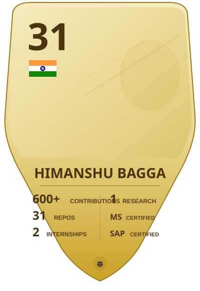

 

  

# HIMANSHU BAGGA

 

### Java Backend Developer

 

 

  

  

---

  

## 👨‍💻 About Me

 

I'm a **Java Backend Developer** passionate about designing scalable systems and solving real-world engineering problems. Currently building production-ready software with **Spring Boot**, **System Design**, and **Distributed Architecture**.

I enjoy working on enterprise applications that demand reliability, performance, and clean architecture. My focus is on building backend systems that scale.

  

---

  

## 💼 Experience

 

<table>
<tr>
<td width="50%" valign="top" style="background: linear-gradient(135deg, rgba(99,102,241,0.06) 0%, rgba(139,92,246,0.03) 100%); border: 1px solid rgba(99,102,241,0.12); border-radius: 20px; padding: 32px;">

 

### 🏢 Java Developer Intern

 

**Judge India Solutions (The Judge Group)**

 

📅 `June 2026 – July 2026`

 

Built a GIS-enabled enterprise platform using modern backend technologies.

 

**Tech Stack:**

 

`Spring Boot` `PostgreSQL/PostGIS` `JWT` `Redis` `ActiveMQ` `WebSockets` `Docker`

 

**Key Achievements:**

 

- Enterprise Authentication & RBAC
- GIS Analytics & Real-time Dashboards
- Audit Logging & Record Replay
- Document Management Services

 

</td>
<td width="50%" valign="top" style="background: linear-gradient(135deg, rgba(139,92,246,0.06) 0%, rgba(99,102,241,0.03) 100%); border: 1px solid rgba(139,92,246,0.12); border-radius: 20px; padding: 32px;">

 

### 🏢 Backend Developer Intern

 

**Sentinel Layer (SaaS Startup)**

 

📅 `June 2025 – Present`

 

Building scalable SaaS backend systems and production-ready features.

 

**Tech Stack:**

 

`Java` `Spring Boot` `REST APIs` `JWT` `PostgreSQL` `Redis` `Docker` `Git`

 

**Key Achievements:**

 

- Production SaaS Backend
- Authentication & Authorization
- Pricing Systems & Architecture Design
- Performance Optimization

 

</td>
</tr>
</table>

  

---

  

## 🔧 Currently Building

 

<table>
<tr>
<td width="50%" valign="top" style="background: linear-gradient(135deg, rgba(99,102,241,0.06) 0%, rgba(139,92,246,0.03) 100%); border: 1px solid rgba(99,102,241,0.12); border-radius: 20px; padding: 28px;">

 

### 🌊 Disaster Damage Assessment Portal

 

Full-stack disaster management platform for digital reporting, field inspections, and compensation.

 

`Spring Boot` `MySQL` `JWT`

 

</td>
<td width="50%" valign="top" style="background: linear-gradient(135deg, rgba(139,92,246,0.06) 0%, rgba(99,102,241,0.03) 100%); border: 1px solid rgba(139,92,246,0.12); border-radius: 20px; padding: 28px;">

 

### ✨ Lovable Clone

 

AI-powered website builder with authentication, project management, and AI-assisted generation.

 

`Spring Boot` `React.js` `PostgreSQL`

 

</td>
</tr>
<tr>
<td width="50%" valign="top" style="background: linear-gradient(135deg, rgba(99,102,241,0.06) 0%, rgba(139,92,246,0.03) 100%); border: 1px solid rgba(99,102,241,0.12); border-radius: 20px; padding: 28px;">

 

### 🔗 LinkUP

 

Professional networking platform with secure API design and real-time features.

 

`JWT` `Redis` `WebSocket` `Docker`

 

</td>
<td width="50%" valign="top" style="background: linear-gradient(135deg, rgba(139,92,246,0.06) 0%, rgba(99,102,241,0.03) 100%); border: 1px solid rgba(139,92,246,0.12); border-radius: 20px; padding: 28px;">

 

### 🍃 Food Waste Management

 

Platform connecting NGOs and restaurants for donation tracking and inventory management.

 

`Spring Boot` `React` `MySQL`

 

</td>
</tr>
</table>

  

---

  

## 💻 Tech Stack

 

<table>
<tr>
<td width="50%" valign="top" style="background: linear-gradient(135deg, rgba(99,102,241,0.06) 0%, rgba(139,92,246,0.03) 100%); border: 1px solid rgba(99,102,241,0.12); border-radius: 20px; padding: 32px;">

### ☕ Backend

 

<table>
<tr>
<td align="center" width="90">

 
<b>Java</b>
</td>
<td align="center" width="90">

 
<b>Spring Boot</b>
</td>
<td align="center" width="90">

 
<b>Spring Security</b>
</td>
<td align="center" width="90">

 
<b>Hibernate</b>
</td>
</tr>
<tr>
<td align="center" width="90">

 
<b>JPA</b>
</td>
<td align="center" width="90">

 
<b>JWT</b>
</td>
<td align="center" width="90">

 
<b>REST APIs</b>
</td>
<td align="center" width="90">

 
<b>Microservices</b>
</td>
</tr>
</table>

</td>
<td width="50%" valign="top" style="background: linear-gradient(135deg, rgba(139,92,246,0.06) 0%, rgba(99,102,241,0.03) 100%); border: 1px solid rgba(139,92,246,0.12); border-radius: 20px; padding: 32px;">

### ⚛️ Frontend

 

<table>
<tr>
<td align="center" width="90">

 
<b>React.js</b>
</td>
<td align="center" width="90">

 
<b>JavaScript</b>
</td>
<td align="center" width="90">

 
<b>HTML</b>
</td>
<td align="center" width="90">

 
<b>CSS</b>
</td>
</tr>
<tr>
<td align="center" width="90">

 
<b>Tailwind</b>
</td>
<td align="center" width="90"></td>
<td align="center" width="90"></td>
<td align="center" width="90"></td>
</tr>
</table>

</td>
</tr>
</table>

 

<table>
<tr>
<td width="50%" valign="top" style="background: linear-gradient(135deg, rgba(99,102,241,0.06) 0%, rgba(139,92,246,0.03) 100%); border: 1px solid rgba(99,102,241,0.12); border-radius: 20px; padding: 32px;">

### 🗄️ Database

 

<table>
<tr>
<td align="center" width="90">

 
<b>MySQL</b>
</td>
<td align="center" width="90">

 
<b>PostgreSQL</b>
</td>
<td align="center" width="90">

 
<b>Redis</b>
</td>
<td align="center" width="90"></td>
</tr>
</table>

</td>
<td width="50%" valign="top" style="background: linear-gradient(135deg, rgba(139,92,246,0.06) 0%, rgba(99,102,241,0.03) 100%); border: 1px solid rgba(139,92,246,0.12); border-radius: 20px; padding: 32px;">

### ☁️ Cloud & DevOps

 

<table>
<tr>
<td align="center" width="90">

 
<b>Docker</b>
</td>
<td align="center" width="90">

 
<b>Git</b>
</td>
<td align="center" width="90"></td>
<td align="center" width="90"></td>
</tr>
</table>

</td>
</tr>
</table>

 

<table>
<tr>
<td width="50%" valign="top" style="background: linear-gradient(135deg, rgba(99,102,241,0.06) 0%, rgba(139,92,246,0.03) 100%); border: 1px solid rgba(99,102,241,0.12); border-radius: 20px; padding: 32px;">

### 🛠️ Tools

 

<table>
<tr>
<td align="center" width="90">

 
<b>IntelliJ</b>
</td>
<td align="center" width="90">

 
<b>VS Code</b>
</td>
<td align="center" width="90">

 
<b>Postman</b>
</td>
<td align="center" width="90">

 
<b>Maven</b>
</td>
</tr>
</table>

</td>
<td width="50%" valign="top" style="background: linear-gradient(135deg, rgba(139,92,246,0.06) 0%, rgba(99,102,241,0.03) 100%); border: 1px solid rgba(139,92,246,0.12); border-radius: 20px; padding: 32px;">

### 💬 Languages

 

<table>
<tr>
<td align="center" width="90">

 
<b>Java</b>
</td>
<td align="center" width="90">

 
<b>JavaScript</b>
</td>
<td align="center" width="90">

 
<b>SQL</b>
</td>
<td align="center" width="90">

 
<b>Python</b>
</td>
</tr>
</table>

</td>
</tr>
</table>

  

---

  

## 🚀 Featured Projects

 

<table>
<tr>
<td width="50%" valign="top" style="background: linear-gradient(135deg, rgba(99,102,241,0.06) 0%, rgba(139,92,246,0.03) 100%); border: 1px solid rgba(99,102,241,0.12); border-radius: 20px; padding: 32px;">

 

### 🌊 Disaster Damage Assessment Portal

 

A full-stack disaster management platform for digital disaster reporting, field inspections, damage assessment, and compensation management.

 

**Tech Stack:**

`Spring Boot` `Spring Security` `MySQL` `JWT`

 

**Key Features:**

- Secure Authentication & Authorization
- Role-Based Access Control
- Disaster Reporting Workflow
- Field Inspection Management
- Damage Assessment & Compensation
- Admin Dashboard

 

 

 

</td>
<td width="50%" valign="top" style="background: linear-gradient(135deg, rgba(139,92,246,0.06) 0%, rgba(99,102,241,0.03) 100%); border: 1px solid rgba(139,92,246,0.12); border-radius: 20px; padding: 32px;">

 

### ✨ Lovable Clone SpringBoot

 

AI-powered website builder inspired by Lovable.dev with authentication, project management and AI-assisted generation.

 

**Tech Stack:**

`Spring Boot` `React.js` `PostgreSQL` `JWT`

 

**Key Features:**

- AI-powered website generation
- Prompt-based project creation
- Secure Authentication
- Project Management
- AI-assisted Code Generation

 

 

 

</td>
</tr>
<tr>
<td width="50%" valign="top" style="background: linear-gradient(135deg, rgba(99,102,241,0.06) 0%, rgba(139,92,246,0.03) 100%); border: 1px solid rgba(99,102,241,0.12); border-radius: 20px; padding: 32px;">

 

### 🔗 LinkUP

 

Professional networking platform with secure API design, real-time features, and scalable architecture.

 

**Tech Stack:**

`Spring Boot` `JWT` `Redis` `WebSocket` `Docker`

 

**Key Features:**

- JWT Authentication
- Pagination & Sorting
- Secure REST APIs
- User Profile Management
- Real-time Notifications

 

 

 

</td>
<td width="50%" valign="top" style="background: linear-gradient(135deg, rgba(139,92,246,0.06) 0%, rgba(99,102,241,0.03) 100%); border: 1px solid rgba(139,92,246,0.12); border-radius: 20px; padding: 32px;">

 

### 🍃 Food Waste Management System

 

Platform connecting NGOs and restaurants for donation tracking, inventory management, and real-time updates.

 

**Tech Stack:**

`Spring Boot` `React` `MySQL`

 

**Key Features:**

- Donation Tracking
- Inventory Management
- Role-based Access Control
- Real-time Updates
- Analytics Dashboard

 

 

 

</td>
</tr>
</table>

  

---

  

## ✨ Highlights

 

<table>
<tr>
<td width="33%" valign="top" style="background: linear-gradient(135deg, rgba(99,102,241,0.06) 0%, rgba(139,92,246,0.03) 100%); border: 1px solid rgba(99,102,241,0.12); border-radius: 20px; padding: 32px;">

 

### 🏆 Research & Publications

 

Published peer-reviewed paper at **4th ICICACS 2026** on intelligent computing and advanced systems.

 

[📄 View Publication](#)

 

</td>
<td width="33%" valign="top" style="background: linear-gradient(135deg, rgba(139,92,246,0.06) 0%, rgba(99,102,241,0.03) 100%); border: 1px solid rgba(139,92,246,0.12); border-radius: 20px; padding: 32px;">

 

### 🌍 Global Certifications

 

Microsoft, SAP, Oracle, and AWS certifications in AI, Cloud, and Machine Learning.

 

[🎓 View Certifications](#certifications)

 

</td>
<td width="33%" valign="top" style="background: linear-gradient(135deg, rgba(99,102,241,0.06) 0%, rgba(139,92,246,0.03) 100%); border: 1px solid rgba(99,102,241,0.12); border-radius: 20px; padding: 32px;">

 

### 🚀 Hackathons & Competitions

 

Smart India Hackathon participant and hackathon finalist with hands-on competition experience.

 

[🏅 View Details](#)

 

</td>
</tr>
</table>

  

---

  

## 📄 Research Publication

 

<table>
<tr>
<td width="80" align="center" valign="top" style="padding-right: 24px;">

</td>
<td valign="top">

### 📝 Peer-Reviewed Conference Publication

 

**Conference:** 4th International Conference on Inventive Computing and Advanced Systems (ICICACS 2026)

 

**Status:** Published & Indexed

 

**Year:** 2026

 

A peer-reviewed research paper on intelligent computing and advanced systems published at an international conference.

 

[📄 View Publication](#) <!-- REPLACE: Add your paper link here -->

</td>
</tr>
</table>

  

---

  

## 🎓 Global Certifications

 

<table>
<tr>
<td width="50%" valign="top" style="background: linear-gradient(135deg, rgba(99,102,241,0.06) 0%, rgba(139,92,246,0.03) 100%); border: 1px solid rgba(99,102,241,0.12); border-radius: 20px; padding: 28px;">

 

**Microsoft Certified**

 

SQL AI Developer Associate

 

</td>
<td width="50%" valign="top" style="background: linear-gradient(135deg, rgba(139,92,246,0.06) 0%, rgba(99,102,241,0.03) 100%); border: 1px solid rgba(139,92,246,0.12); border-radius: 20px; padding: 28px;">

 

**SAP Global Certification**

 

Certified Professional

 

</td>
</tr>
<tr>
<td width="50%" valign="top" style="background: linear-gradient(135deg, rgba(99,102,241,0.06) 0%, rgba(139,92,246,0.03) 100%); border: 1px solid rgba(99,102,241,0.12); border-radius: 20px; padding: 28px;">

 

**Oracle Cloud Infrastructure**

 

2025 AI Foundations Associate

 

</td>
<td width="50%" valign="top" style="background: linear-gradient(135deg, rgba(139,92,246,0.06) 0%, rgba(99,102,241,0.03) 100%); border: 1px solid rgba(139,92,246,0.12); border-radius: 20px; padding: 28px;">

 

**AWS Academy**

 

Machine Learning Foundations

 

</td>
</tr>
</table>

  

---

  

## 📚 Professional Learning

 

<table>
<tr>
<td width="50%" valign="top" style="background: linear-gradient(135deg, rgba(99,102,241,0.06) 0%, rgba(139,92,246,0.03) 100%); border: 1px solid rgba(99,102,241,0.12); border-radius: 20px; padding: 28px;">

 

**Coursera**

 

Supervised Machine Learning

 

</td>
<td width="50%" valign="top" style="background: linear-gradient(135deg, rgba(139,92,246,0.06) 0%, rgba(99,102,241,0.03) 100%); border: 1px solid rgba(139,92,246,0.12); border-radius: 20px; padding: 28px;">

 

**Coursera**

 

Advanced Learning Algorithms

 

</td>
</tr>
</table>

  

---

  

## 📊 GitHub Analytics

 

 

 

  

---

  

## 🐍 Contribution Snake

 

  

---

  

## 🤝 Let's Connect

 

  

---

  

*"Building scalable backend systems, one commit at a time."*

 
